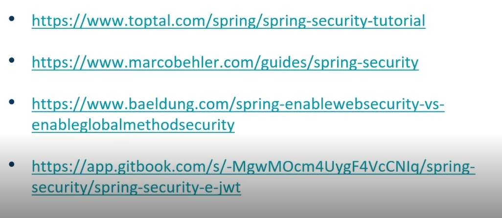

# Adicionando Segurança a uma API REST com Spring Security

- Introdução sobre Segurança
- Habilitando segurança com Spring
- Configure adapter
- Adaptação com o banco de dados 
- JWT - Json Web Token

## Links

- 